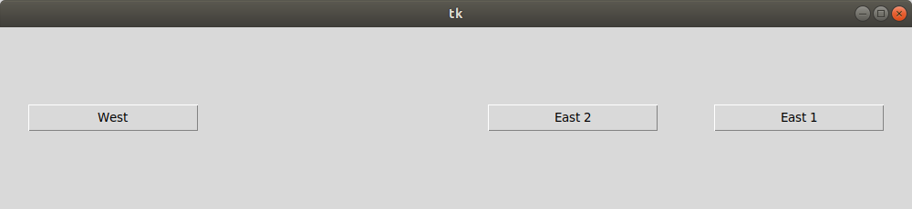
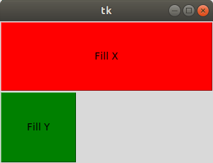
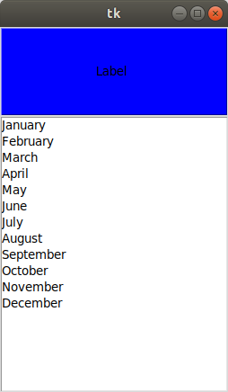
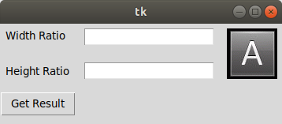
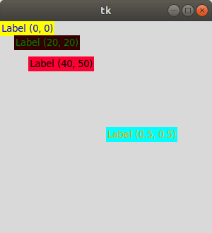

# pack

[Привязка в левой/правой стороне окна](Geometry_Pack_Relative Position.py)

[Заполнение по ширине/высоте окна](Geometry_Pack_Fill.py)

[Автоматическое расширение Listbox](Geometry_Pack_Expand.py)

# grid

[Размещение в ячейках и объединение ячеек](Tkinter Geometry_Grid_Basic.py)

# place

[Размещение по абсолютным и относительным координатам](Tkinter Geometry_Place_Basic.py)

